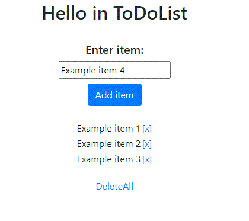

## **ToDoList**
ToDoList is CRUD application. It is using Java 11, Spring Boot, Maven, H2, Thymeleaf, Lombok.

##

## **Installation**
In the beggining of instalation you need to install java 11 and maven.

[Maven](https://maven.apache.org/download.cgi) \
[Java 11](https://adoptopenjdk.net/)

Application is available on below localhost: http://localhost:8080/index

## Endpoints:
GET /index - get list of all items

GET /delete/{id} - delete item by id

GET /deleteAll - delete all items

POST /save - save item in entity 
